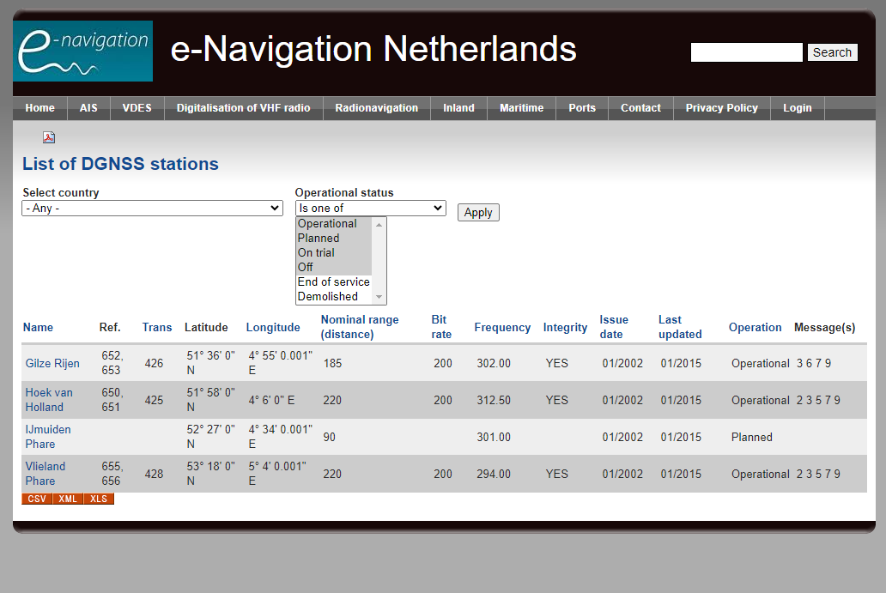

# IALA S-240 XML to GML Converter

This repository contains a Python script that converts IALA's S-240 (DGNSS) XML data into GML format. The script reads the S-240 XML file, extracts the data, and outputs it as a GML file required by the S-200 Testbed.
You can get the S-240 data from here: https://www.e-navigation.nl/list-DGNSS-stations




## Requirements

Before running the script, ensure that you have all the necessary Python packages installed. You can install the required packages using `pip` and the provided `req.txt` file.

### Installation

1. Clone this repository:
    ```bash
    git clone https://github.com/yourusername/dgnss-xml-to-gml.git
    cd dgnss-xml-to-gml
    cd source
    ```

2. Install the required Python packages:
    ```bash
    pip install -r req.txt
    ```

## Usage

To run the conversion script, simply execute the following command:

```bash
python dgnss_xml_to_gml.py
```

## Result

The generated GML data can be visualized here: http://new-tds.bluemap.kr/

